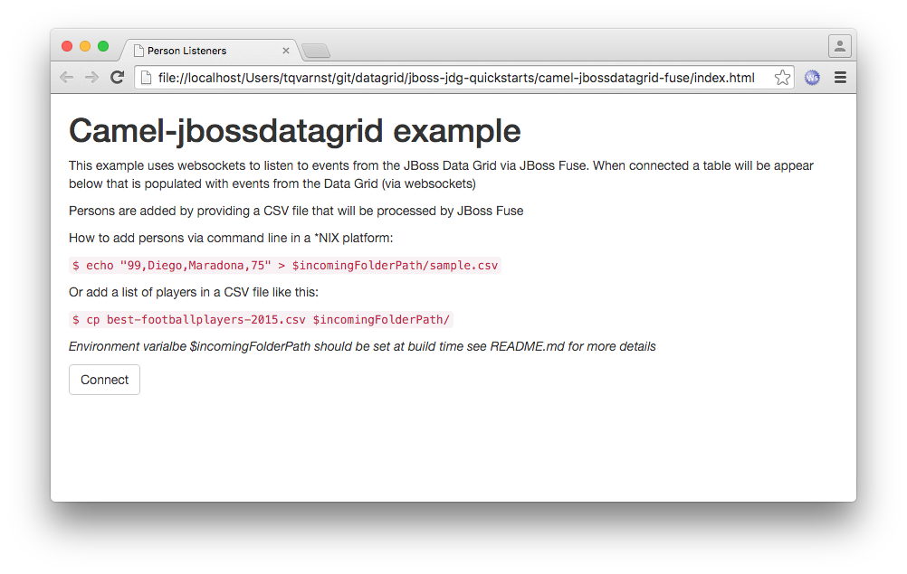
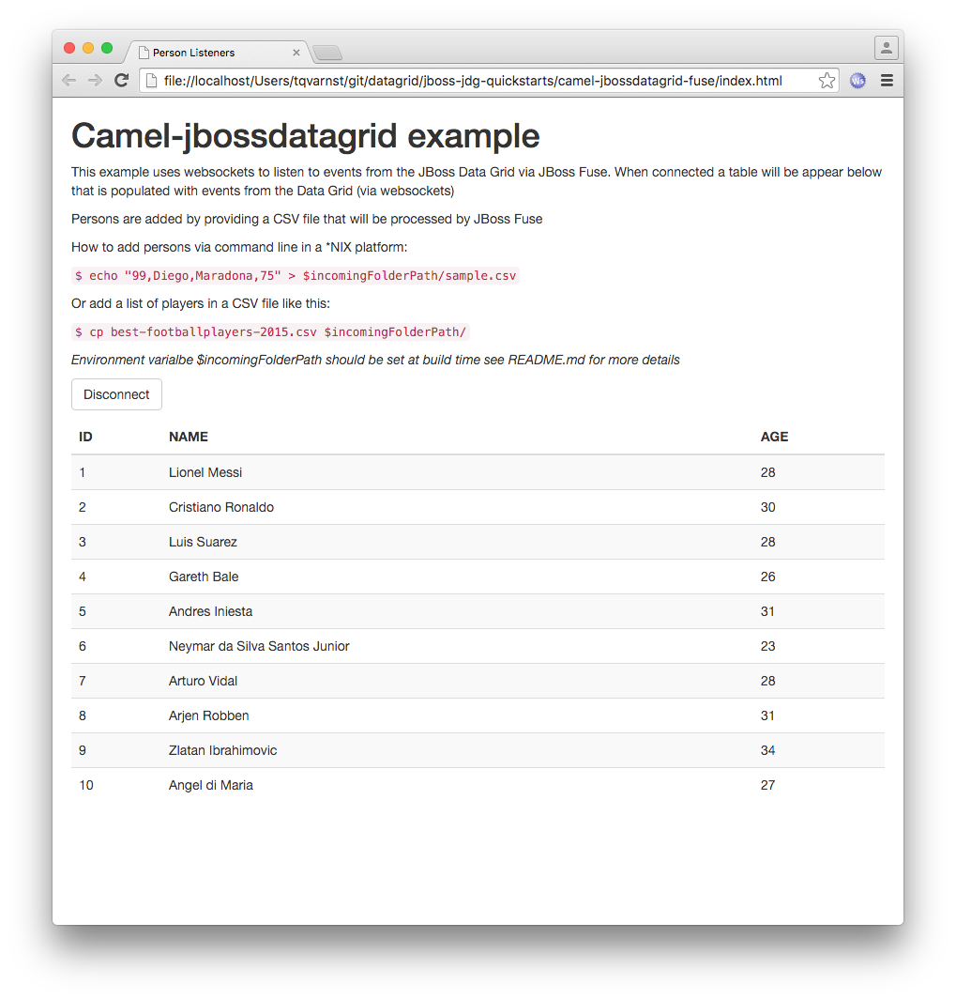

camel-jbossdatagrid-fuse: Example Using Infinispan Cache on Camel Routes
=================================================================
* Author: Vijay Chintalapati, Thomas Qvarnstrom
* Level: Intermediate
* Technologies: Infinispan, Camel
* Summary: The `camel-jbossdatagrid-fuse` quickstart demonstrates how to use Infinispan cache through camel-jbossdatagrid component on JBoss Fuse.
* Target Product: JDG
* Product Versions: JDG 6.6, Fuse 6.2
* Source: <https://github.com/infinispan/jdg-quickstart>

What is it?
-----------

The `camel-jbossdatagrid-fuse` quickstart will deploy two bundles __local_datagrid_producer__ and __local_datagrid_consumer__ on Fuse, one on each container __child1__ and __child2__ respectively.

* __local_datagrid_producer__ : Scans a folder (/tmp/incoming) for incoming CSV files of the format "id, firstName, lastName, age". If a file is dropped with entries in the given format, each entry is read and transformed into a Person POJO and stored in the data grid
* __local_datagrid_consumer__ : Lets you query for a POJO using a RESTful interface and get back  a JSON representation of the Person POJO stored in the data grid for the given key

_The bundles reside in two different containers and the reason why the consumer is able to extract what the producer has put in, is because of the use of same configuration in files: infinispan.xml and jgroups.xml on both sides. The infinispan.xml file has a **REPL (replicated)** datagrid definition by the name **camel-datastore** and this is the datagrid with which the producer and consumer interact_

System requirements
-------------------

All you need to build this project is Java SDK 1.7 or better, Maven 3.0 or better.

The application this project produces is designed to be run on JBoss Fuse 6.2.0 or later.
 
Configure Maven
---------------

If you have not yet done so, you must [Configure Maven](https://github.com/jboss-developer/jboss-developer-shared-resources/blob/master/guides/CONFIGURE_MAVEN.md#configure-maven-to-build-and-deploy-the-quickstarts) before testing the quickstarts.

Setup the quickstart
----------------------

1. Download the Fuse binary __jboss-fuse-full-6.2.0.redhat-133.zip__ from either http://www.jboss.org/products or from Red Hat's Customer portal
2. Export the path to the folder where the CSV files will be placed by running the command of the form `export incomingFolderPath=[Full path to the CSV folder]`
3. Run `mvn clean install -DincomingFolderPath=$incomingFolderPath` in the root folder of the quickstart
4. Set the following two environment variables in the same shell: 
  1. export __FUSE_INSTALL_PATH__ = _[Full path to the folder into where Fuse will be installed]_ 
  2. export __FUSE_BINARY_PATH__ = _[Full path to the Fuse binary file]_ 
5. While in the root folder of the quickstart, run `./setupEverythingOnFuse.sh`

Setup Verification
------------------

1. Verify your access to the [Fuse Hawtio Console] (http://127.0.0.1:8181/hawtio/index.html#/login). The __username/password__ is __admin/admin__.
2. If the __Fuse Fabric__ is created right, you should be able to access the containers [here](http://127.0.0.1:8181/hawtio/index.html#/fabric/containers)
3. Verify if you see two containers created by the names __child1__ and __child2__. Also note if root/child1/child2 are all in __green__, if they are not click on their names andcapture the logs displayed.  

Testing
-------

1. Open [index.html](./index.html) in a browser (Note: index.html is a local file that is located in the camel-jbossdatagrid-fuse directory)
   
2. Click on connect
   
2. Add the best football (soccer) players 2015 by executing `$ cp best-footballplayers-2015.csv $incomingFolderPath/`
3. Check that the players were added to the table in the browser
   
4. Add another player by executing `$ echo "99,Diego,Maradona,75" > $incomingFolderPath/sample.csv`
5. Verify that another player was added to the table in the browser

It's also possible to open multiple browsers and connect them and verify that all clients get the same updates!

How does it work
----------------
1. The local\_datagrid_producer will listen to incoming files in the folder $incomingFolderPath. It will transform each line in the CSV to Java object and store them in the local datagrid.
   
2. The local\_datagrid_consumer will react to events that an entry has been added to the datagrid and will retrieve the Java object, transform it to JSON and push it to WebSocket clients that are connected.   
   
